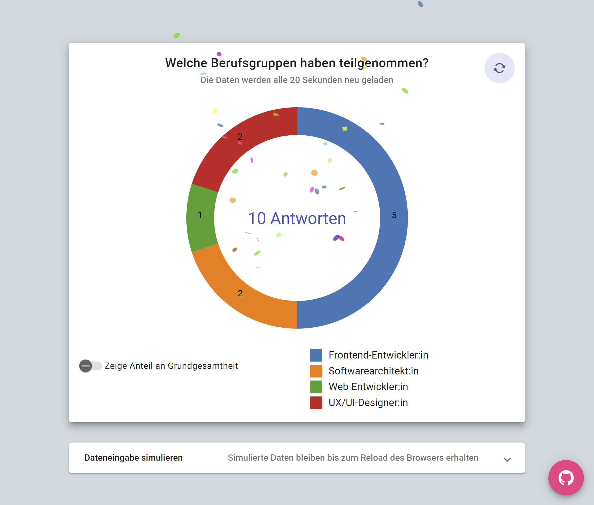

# Interaktive Visualisierung von Umfrageergebnissen

Diese Angular-Anwendung bildet die Ergebnisse einer Umfrage, welche die Bewertung der Wichtigkeit von IT-Trends in unterschiedlichen Berufsgruppen mithilfe eines Fragebogens erfasst, als interaktive Datenvisualisierung ab. Die Anwendung zeigt exemplarisch, wie Angular und D3.js zur Erstellung von interaktiven Datenvisualisierungen kombiniert werden können. Dabei werden mit der programmatischen Erzeugung und der deklarativen Erzeugung von visuellen Elementen die beiden wichtigsten Herangehensweisen bei Umsetzung von Datenvisualisierungen vorgestellt.

## asd

## Development server

Run `ng serve` for a dev server. Navigate to `http://localhost:4200/`. The application will automatically reload if you change any of the source files.

## Build

Run `ng build` to build the project. The build artifacts will be stored in the `dist/` directory.

## Running unit tests

Run `ng test` to execute the unit tests via [Karma](https://karma-runner.github.io).

